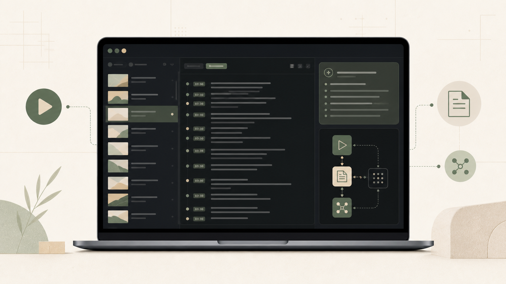

# YT Sum



**Local-first YouTube transcript and AI summary library for macOS.** Import videos and playlists, keep readable transcripts and artifacts on disk, and process them with your own local or OpenAI-compatible language models.

> Bring your own models. Keep your library local. Turn long videos into useful knowledge.

## Quick start

```bash
./scripts/dev.sh
```

- UI: http://127.0.0.1:3000
- API: http://127.0.0.1:8765

## Browser extension

Load `browser-extension/` as an unpacked Manifest V3 extension in Chrome/Chromium.

- Open `chrome://extensions` and enable Developer mode
- Choose Load unpacked and select `browser-extension`
- Set API address in Extension options if needed; default is `http://127.0.0.1:8765`
- Open a YouTube video and click the queue button

The extension only talks to `localhost` or `127.0.0.1`, and its bearer token stays scoped to that address.

## Library

- Add a video or playlist URL to the library
- Playlist imports keep original order and membership
- Re-importing a playlist refreshes membership without duplicate jobs
- Each video stores transcript, summary, thumbnail, and `.meta.json` in the selected library folder

## Requirements

- macOS 14.2+
- Python 3.11+
- Node 22.13+
- `yt-dlp`
- `ffmpeg`
- Optional: Meeting Transcriber for audio-only fallback

## Tests

```bash
.venv/bin/python -m pytest
npm test
```

## Docs

- [docs/SPECIFICATION.md](docs/SPECIFICATION.md)
- [docs/ARCHITECTURE.md](docs/ARCHITECTURE.md)
- [docs/FILE_FORMAT.md](docs/FILE_FORMAT.md)
- [docs/RELEASE.md](docs/RELEASE.md)
