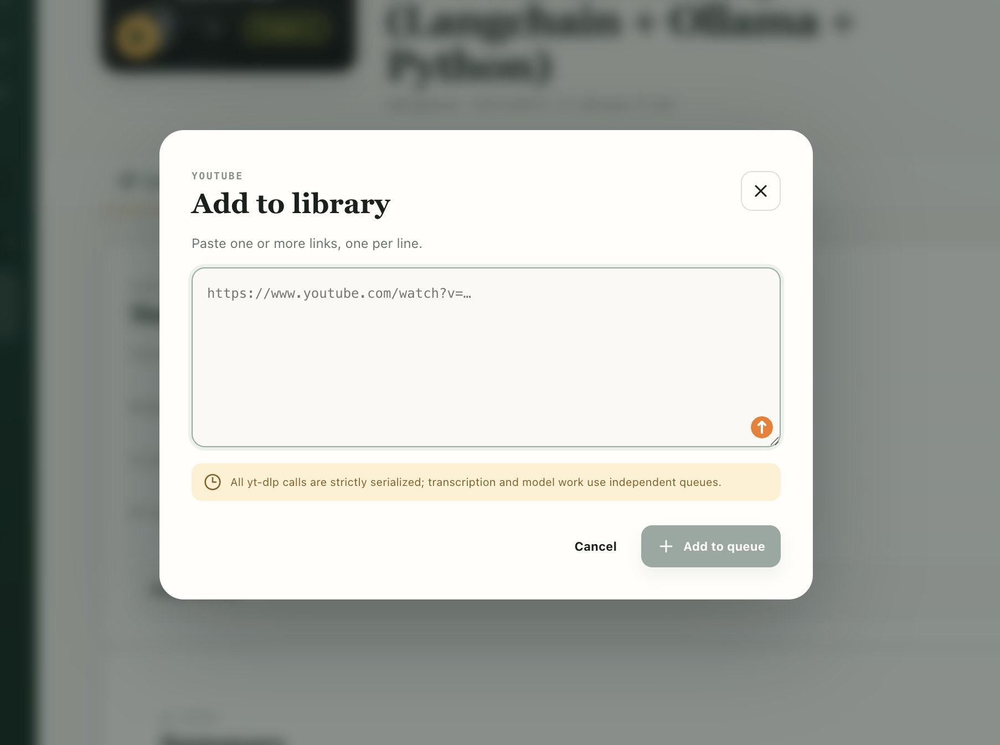
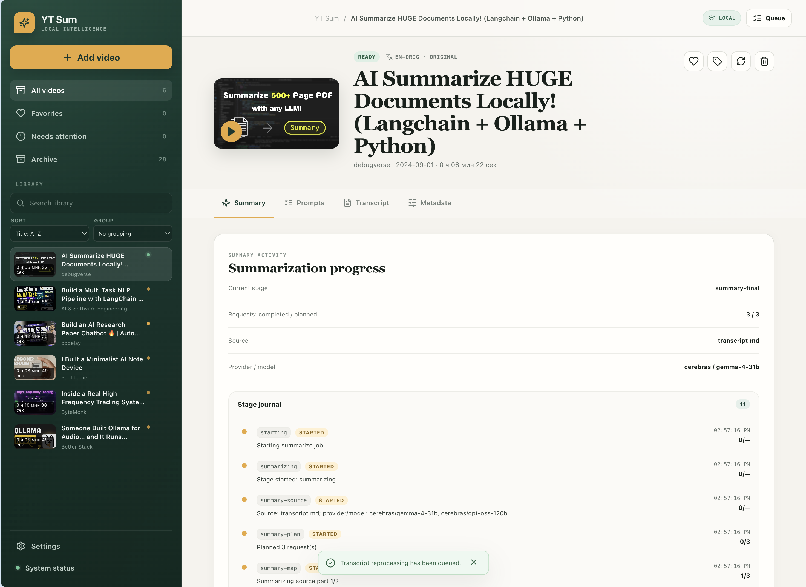
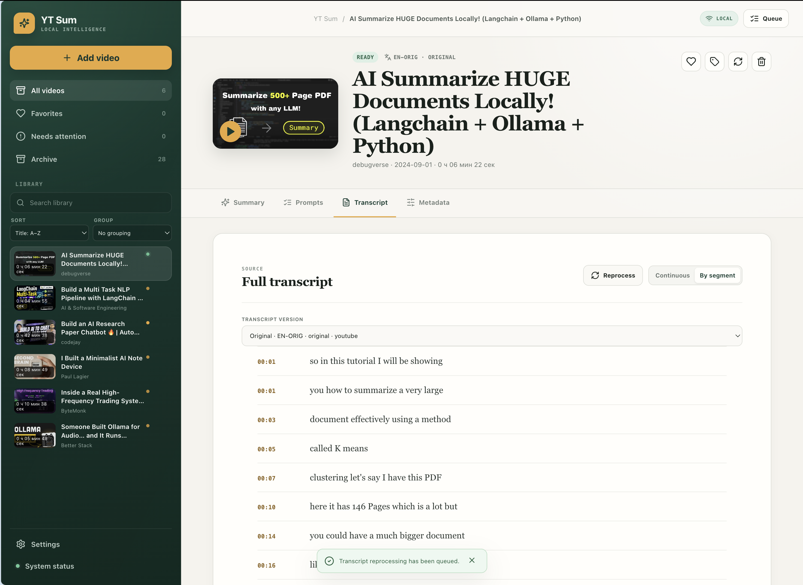

# YT Sum


<p>
  
  
  
  
  
</p>

YT Sum is a local-first macOS app for turning YouTube videos into transcripts, summaries, and a portable knowledge library. It keeps the workflow on your Mac, uses conservative YouTube access, and supports both local and OpenAI-compatible models.

## What You Get

- import one URL, many URLs, or a full playlist
- fetch the best transcript available, then fall back to audio transcription when needed
- keep transcript, summary, thumbnail, metadata, and processing history per video
- queue videos from YouTube with the browser extension
- inspect queues, resources, providers, and system state in diagnostics

## Why Use It

- your content stays in a local folder of Markdown and JSON files
- playlist refreshes do not create duplicate jobs
- the app is built for long videos, repeated reference, and reprocessing

## Preview

<table>
  <tr>
    <td align="center">
      
      <br><sub>Add to library</sub>
    </td>
    <td align="center">
      
      <br><sub>Summary progress</sub>
    </td>
    <td align="center">
      
      <br><sub>Full transcript</sub>
    </td>
  </tr>
</table>

## Quick start

```bash
./scripts/dev.sh
```

- UI: http://127.0.0.1:3000
- API: http://127.0.0.1:8765

## Requirements

- macOS 14.2+
- Python 3.11+
- Node 22.13+
- `yt-dlp`
- `ffmpeg`
- Optional: Meeting Transcriber for audio-only fallback

## Browser extension

Load `browser-extension/` as an unpacked Manifest V3 extension in Chrome or Chromium.

1. Open `chrome://extensions`
2. Enable Developer mode
3. Choose Load unpacked and select `browser-extension`
4. Set the API address if needed
5. Open a YouTube video and click the queue button

The extension only talks to `localhost` or `127.0.0.1`.

## Data model

Each video lives in its own folder inside the library. The folder contains the transcript, summary, thumbnail, and `.meta.json`. The SQLite database is only a rebuildable index.

## Learn more

- [Product spec](docs/SPECIFICATION.md)
- [Architecture](docs/ARCHITECTURE.md)
- [File format](docs/FILE_FORMAT.md)
- [Release process](docs/RELEASE.md)
