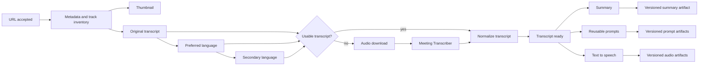

# Durable Processing Pipeline

Status: approved on 2026-08-15. This document is the normative pipeline contract.

## Design goals

Every video owns a durable workflow. A workflow is a directed acyclic graph of stage tasks, not a monolithic background job. Stage tasks retain independent state, attempts, resource waits, logs, checkpoints, and artifacts. A late optional failure must not invalidate an earlier successful artifact.

The backend scheduler is the only component allowed to claim work. The browser submits commands and renders snapshots/events; it never infers execution state.

## Workflow graph

Thumbnail, chapters, and descriptions are optional branches. Original downloaded subtitle files are immutable. Parsing, overlap removal, clean text, Markdown, and language selection create derived artifacts.

The transcript order is: original language, preferred language, secondary language, then local ASR when no downloaded candidate is usable. Author captions take precedence over automatic captions for the same language. Identical physical tracks are downloaded once and may carry several logical roles.

## Resources and scheduling

Stage concurrency and resource concurrency are separate concerns. A ready stage first waits in its stage queue and then obtains every required resource lease.

| Resource | Default capacity | Contract |
| --- | ---: | --- |
| `yt_dlp` | 1 | Every yt-dlp invocation is globally serialized, including playlist inventory. |
| `asr` | 1 | Meeting Transcriber work; configurable without restart. |
| `llm:<provider>` | 1 | Per-endpoint in-flight limit plus an independent RPM token bucket. |
| `tts` | 1 | Independent of LLM workers. |
| `storage` | bounded | Atomic artifact commits; never exposes partial output as ready. |

Direct HTTP thumbnail downloads do not consume the yt-dlp lease. ASR, LLM, TTS, and artifact writes may run while yt-dlp serves another workflow.

Queues use priority plus aging. User priorities are low, normal, high, and next. LLM chunk scheduling is work-conserving and fair across workflows: a single video may use every idle compatible endpoint, but yields capacity when another workflow becomes ready.

An endpoint has health, in-flight capacity, RPM state, cooldown, and a circuit breaker. A failed chunk returns to the compatible pool. Successful map results are checkpoints. Reduce begins only when required inputs exist and forms a multi-level tree when necessary.

## Settings and artifacts

Every workflow stores an immutable settings snapshot. Later setting changes apply only to later workflows. Artifacts record their input checksums, language, model and endpoint, prompt version, strategy, chunk parameters, application version, timing, and request counts.

Changing an input invalidates only descendants of that input. A refresh checks metadata and transcript candidates. It marks dependent artifacts stale only when their effective source changes.

Completed files remain portable in each video folder. SQLite is authoritative for active workflow coordination; `.meta.json` plus artifacts are sufficient to reconstruct completed library records.

## Control semantics

- Pause finishes the current atomic external operation and prevents the next operation from starting.
- Stop cancels queued/waiting tasks immediately and terminates cancellable HTTP/subprocess work. A resource lease is released only after confirmed termination.
- Retry creates another attempt of the same stage task and retains the previous attempt.
- Restart recovers from the last committed checkpoint. Expired running leases become interrupted attempts.
- Stop all remains latched until an explicit resume.
- Archiving a video does not stop its workflow.

Automatic retries apply only to transient network, timeout, 429, and 5xx failures. Configuration, authentication, validation, and missing-content outcomes require correction or a defined fallback.

## Parent status

Video/workflow status is derived from child tasks and selected required branches. Supported user-facing outcomes are waiting, running, paused, partially ready, ready, requires attention, and stopped. A failed optional prompt or TTS branch produces partial readiness without invalidating the transcript or summary.

