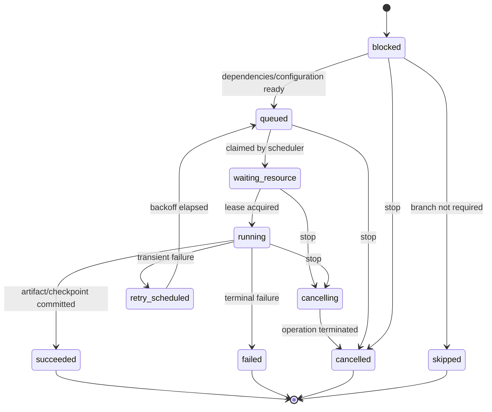

# Pipeline State Machine

Status: approved on 2026-08-15. This document defines state semantics.

## Stage task states

`running` means an operation is genuinely executing and owns a valid resource lease when a resource is required. Merely being claimed by a worker is never `running`.

`waiting_resource` must include a structured `waiting_for` value: resource ID, reason, queue position when known, and eligible-at timestamp for backoff or RPM waits.

`skipped` requires a reason. Skipped tasks are visible in an individual workflow route but do not count as current load.

## Persisted records

- `Workflow`: parent video, type, priority, settings snapshot, derived status, timestamps.
- `StageTask`: stage ID, dependencies, required flag, state, progress, waiting reason, active attempt.
- `Attempt`: ordinal, worker, endpoint/resource, start/end, heartbeat, error classification.
- `ResourceLease`: resource, owner attempt, acquisition and expiry timestamps.
- `Artifact`: version, checksum, path, type, provenance, active/stale flags.
- `PipelineEvent`: monotonic sequence, correlation IDs, transition, progress, safe payload.

## Invariants

1. At most one live `yt_dlp` lease exists.
2. Every resource-bound running task has a non-expired lease.
3. A stage cannot become queued until required dependencies succeeded.
4. One attempt is owned by at most one executor.
5. A ready artifact references a succeeded attempt and committed file.
6. A cancelled attempt cannot commit a ready artifact.
7. Live diagnostics are aggregates over the complete database, independent of list pagination.
8. Conflicting acquisition workflows for one video cannot run concurrently.

## Commands by state

| State | Pause workflow | Stop | Retry | Change priority |
| --- | --- | --- | --- | --- |
| `blocked` | yes | yes | recheck only | yes |
| `queued` | yes | yes | no | yes |
| `waiting_resource` | yes | yes | no | yes |
| `running` | after atomic operation | yes | after stop | workflow only |
| `retry_scheduled` | yes | yes | no | yes |
| `failed` | no | no | yes | before retry |
| `cancelled` | no | no | yes | before retry |
| `succeeded` | no | no | create new version | no |
| `skipped` | no | no | explicit branch enable | no |

